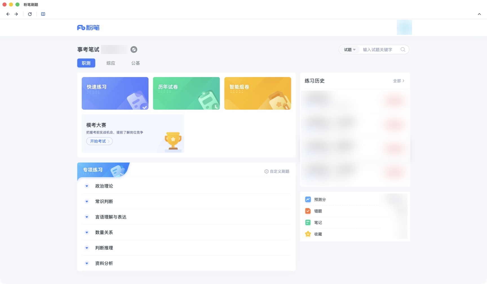
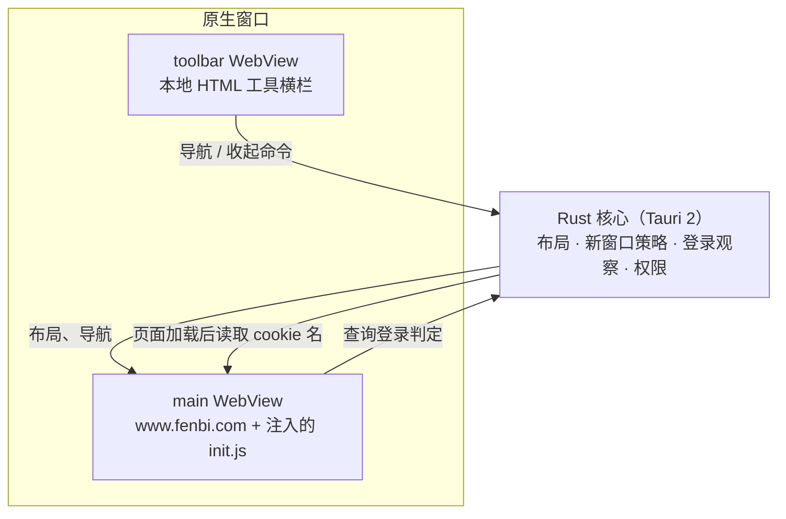

<div align="center">


# 粉笔刷题

**粉笔题库的跨平台桌面客户端：打开即进题库。**

[](https://github.com/windery/fenbi-desktop/releases/latest)
[](https://github.com/windery/fenbi-desktop/actions/workflows/check.yml)


[](LICENSE)

[下载安装](#下载安装) · [使用](#使用) · [工作原理](#工作原理) · [从源码构建](#从源码构建) · [参与贡献](#参与贡献)

<br>



</div>

> [!NOTE]
> 这是个人维护的非官方客户端，与粉笔（fenbi.com）没有关联。题库内容、账号与会话都由粉笔网站提供和管理。

## 为什么做这个

在浏览器里刷题有几个小麻烦：题库入口藏得深，每次要点好几层；标签页一多就找不到；登录完还停在原地。

这个客户端把粉笔官网装进一个独立窗口，启动后直接落在题库目录页，并由网站自己恢复你上次选的考试分类。除此之外，它尽量什么都不做。

## 特性

- **启动即题库**：窗口入口就是题库目录页，考试分类由站点自己恢复，客户端不维护任何分类配置
- **页面减负**：只注入 CSS，隐藏顶部导航 tab、活动横幅、会员推广入口和页脚，不改动站点逻辑
- **独立工具横栏**：返回、前进、刷新、回题库，可收起；运行在独立的本地 WebView 里，不进入网站 DOM，也不随网页滚动或刷新
- **平台原生快捷键**：macOS 用 `Cmd`，Windows / Linux 用 `Alt` / `Ctrl`
- **站内新窗口就地打开**：搜题等 `window.open` / `target="_blank"` 请求在当前窗口打开，站外链接一律不打开
- **登录提示**：本地读不到粉笔登录凭证时，自动拉起站点自己的登录框；登录与会话完全交给粉笔网站
- **记住窗口**：首次启动最大化，之后恢复上次的尺寸、位置和最大化状态
- **轻量**：基于 [Tauri 2](https://v2.tauri.app/) 和系统 WebView，不捆绑浏览器内核，安装包只有 1–2 MB（Linux 的 AppImage 自带运行库，约 76 MB）

## 下载安装

在 [Releases](https://github.com/windery/fenbi-desktop/releases/latest) 页面下载对应平台的安装包：

| 平台 | 文件 | 系统要求 |
| --- | --- | --- |
| macOS（Apple 芯片） | `fenbi-desktop_<版本>_darwin_aarch64.dmg` | macOS 10.15+ |
| macOS（Intel） | `fenbi-desktop_<版本>_darwin_x64.dmg` | macOS 10.15+ |
| Windows x64 | `fenbi-desktop_<版本>_windows_x64-setup.exe` | WebView2（安装时自动准备） |
| Linux x64 | `.AppImage` / `.deb` / `.rpm` | WebKitGTK 4.1 |

> [!IMPORTANT]
> 安装包目前**未签名**，首次打开会被系统拦截，按下面的步骤放行一次即可。

### macOS

打开 `.dmg`，把「粉笔刷题」拖进「应用程序」。首次打开被 Gatekeeper 拦截时，任选一种方式放行：

- 在「应用程序」里**右键 →「打开」**，然后确认
- 或者执行一次：

  ```bash
  xattr -dr com.apple.quarantine /Applications/粉笔刷题.app
  ```

### Windows

双击 `.exe` 安装。SmartScreen 提示时，点**「更多信息」→「仍要运行」**。首次运行会自动准备 WebView2 运行时。

### Linux

```bash
# AppImage：加执行权限后直接运行
chmod +x fenbi-desktop_*.AppImage && ./fenbi-desktop_*.AppImage

# Debian / Ubuntu
sudo dpkg -i fenbi-desktop_*.deb

# Fedora / openSUSE
sudo rpm -i fenbi-desktop_*.rpm
```

### 平台支持状态

三个平台都由 CI 出包，但「能构建」和「实机跑过」是两回事：

| 平台 | 构建 | 实机验证 |
| --- | --- | --- |
| macOS（ARM64 / x64） | ✅ | ✅ 主要开发平台，日常使用 |
| Linux x64 | ✅ | ⚠️ 在 Xvfb 虚拟显示下验证过启动、登录提示、工具栏和窗口恢复 |
| Windows x64 | ✅ | ❌ 尚未实机验证 |

在 Windows 或 Linux 上遇到问题，欢迎[提 issue](https://github.com/windery/fenbi-desktop/issues)。

## 使用

启动后窗口直接落在题库目录页，上次选的考试分类会自动恢复。

### 登录

| 情况 | 表现 |
| --- | --- |
| 第一次打开 | 页面加载完成后本地读不到登录凭证，自动弹出粉笔的登录框（默认手机验证码；点登录框右上角的二维码图标可扫码） |
| 之后打开 | 通常直接进题库，不再弹登录框 |
| 退出登录或凭证消失 | 自动弹出登录框；做题时也一样，练习数据由网站实时上报，不会丢 |
| 网站拒绝了会话，但本地凭证还在 | 客户端无法察觉，由网站自己提示重新登录 |

本地能读到凭证，不代表粉笔服务端仍然接受它，所以最后一种情况只能交给网站处理。

### 工具横栏

窗口顶部是默认展开的 36px 工具横栏：左侧四个按钮依次是返回、前进、刷新、回题库，右侧是收起按钮。鼠标悬停或用键盘聚焦按钮时，横栏空白处会显示操作名称和当前平台的快捷键。

收起后横栏变成 24px 高的细条，点细条任意位置都能展开；收起状态重启后仍保留。横栏读取状态失败时会显示「重试工具栏」，命令被拒绝时会显示简短提示。

从练习或报告页回题库后，可以用「返回」回到原页；原页的答题状态能否恢复，由粉笔网站决定。

### 快捷键

| 作用 | macOS | Windows / Linux |
| --- | --- | --- |
| 返回上一页 | `Cmd` + `[` | `Alt` + `←` |
| 前进 | `Cmd` + `]` | `Alt` + `→` |
| 回题库目录页 | `Cmd` + `⇧` + `[` | `Ctrl` + `⇧` + `[` |
| 刷新页面 | `Cmd` + `R` | `Ctrl` + `R` |
| 展开 / 收起横栏 | `Cmd` + `⇧` + `B` | `Ctrl` + `⇧` + `B` |

### 退出登录与重置

在页面里点右上角头像 →「退出登录」，之后会重新弹出登录框。这是退出登录最可靠的方式。

想清掉客户端自己的数据（工具栏偏好和窗口位置），可以删除应用数据目录：

```bash
# macOS
rm -rf ~/Library/Application\ Support/com.fenbi.wrapper

# Linux
rm -rf ~/.local/share/com.fenbi.wrapper
```

```powershell
# Windows（PowerShell）
Remove-Item -Recurse -Force "$env:APPDATA\com.fenbi.wrapper"
```

登录会话保存在系统 WebView 里，不在这个目录。删掉它之后会话是否跟着清除取决于平台，**不能保证**下次打开一定要求重新登录。

## 工作原理



- **一个窗口、两个 WebView**：Rust 创建原生窗口，再添加本地 `toolbar` 和远程 `main` 两个子 WebView，并负责它们的布局。工具横栏不进入网站 DOM，网站刷新或跳转都不会重建它。
- **注入脚本只做展示层**：`init.js` 在文档开始时注入粉笔页面，负责裁剪 CSS、网站侧快捷键，以及在需要时点击站点自己的登录入口。
- **登录观察在 Rust 侧**：每次页面加载完成后等 1.5 秒，读取一次粉笔域下有哪些登录 cookie，之后每 5 分钟复查一次；结果只存在内存里。页面被唤醒后读取结论（`pending` / `logged-in` / `logged-out`），据此决定是否拉起登录框。
- **新窗口策略**：`https://*.fenbi.com` 的新窗口请求改为在当前窗口打开，其余全部丢弃。Tauri 默认会丢掉所有新窗口请求，而粉笔搜题正是用 `window.open(..., "_blank")` 打开结果页，所以必须接住这类请求。
- **按 WebView 授权**：粉笔页面只能调用「查询登录判定」和「收起横栏」两个命令；导航命令只授权给本地工具横栏。

### 设计边界

客户端只做展示层，**不碰站点业务**：

- 不读题目数据，不驱动答题，不提交试卷，不选分类
- 不调用粉笔的私有接口，不轮询成绩
- 不自动刷新或跳转页面；唯一的导航来自用户点按钮或按快捷键

唯一的例外是点击站点自己的登录入口按钮：桌面端没有地址栏，用户够不到别的入口。早期版本为了「登录后自动跳转」在站点建立会话时执行了 `location.reload()`，打断了正在进行的登录，这条边界就是从那次教训里来的。

## 隐私与安全

- 账号、密码、验证码都直接提交给粉笔网站，客户端拿不到，也不保存
- 为了判断要不要弹登录框，客户端会读取粉笔域下 cookie 的**名字**（检查 `persistent` / `sess` / `userid` 是否存在），不读取值，也不发送到任何地方
- 客户端自己写入磁盘的只有工具栏收起偏好和窗口位置
- 诊断日志默认关闭；打开后也只记录事件、时间和路径，不记录 URL 的查询参数
- 站外链接不会被打开

## 从源码构建

### 环境要求

- Node.js ≥ 22.13，pnpm 11（版本见 `package.json` 的 `packageManager` 字段）
- Rust stable ≥ 1.85（项目使用 2024 edition）
- Tauri 的平台依赖，见 [Tauri 前置条件](https://v2.tauri.app/start/prerequisites/)：
  - macOS：Xcode Command Line Tools
  - Linux：`libwebkit2gtk-4.1-dev` 等，完整列表见 [`check.yml`](.github/workflows/check.yml)
  - Windows：MSVC 生成工具与 WebView2

### 构建与运行

```bash
git clone https://github.com/windery/fenbi-desktop.git
cd fenbi-desktop
pnpm install
pnpm dev
```

| 命令 | 用途 |
| --- | --- |
| `pnpm dev` | debug 增量编译并启动，约 3 秒；仅支持 macOS / Linux，Windows 上的做法见 [CONTRIBUTING.md](CONTRIBUTING.md) |
| `pnpm check` | 提交前必跑：JS 语法、JS 行为测试、`cargo fmt`、`cargo clippy -D warnings`、Rust 单元测试 |
| `pnpm bundle` | release 构建并打安装包（LTO，约 2 分钟），产物在 `src-tauri/target/release/bundle/` |

`pnpm build` 只把工具横栏的静态资源复制到 `dist`，不验证应用。

debug 构建启动时从磁盘读取注入脚本，所以改 `src-tauri/init.js` 后重跑 `pnpm dev` 就能生效，不需要等 Rust 重新编译。

### 项目结构

```text
.
├── src-tauri/
│   ├── src/
│   │   ├── lib.rs          # 建窗、登录观察线程、命令注册
│   │   ├── toolbar.rs      # 双 WebView 布局、工具横栏命令与状态
│   │   └── login_state.rs  # 纯逻辑：凭证三态、观察调度、URL 策略
│   ├── init.js             # 注入粉笔页面：裁剪 CSS、快捷键、登录提示
│   ├── toolbar/            # 本地工具横栏 HTML / CSS / JS，快捷键表的唯一定义处
│   ├── capabilities/       # 按 WebView 划分的权限；dev/ 只在 debug 构建生效
│   └── tauri.conf.json
├── tests/                  # JS 行为测试与精简页面夹具
├── scripts/                # 开发启动脚本、工具横栏资源复制
└── .github/workflows/      # check（PR 与 main）、release（tag 触发）
```

## 参与贡献

欢迎提 issue 和 PR。动手之前请先读 [CONTRIBUTING.md](CONTRIBUTING.md)，里面有架构细节、已验证的站点事实、排查手册和发布流程。几条硬约束：

- 不让客户端判断或驱动站点业务，见[设计边界](#设计边界)
- 改登录时序、路由判断或凭证读取：先写能复现问题的测试，再改实现
- 提交前 `pnpm check` 必须通过
- 改 UI 裁剪的选择器，要对照真实页面核对；CSS 测试只检查注入的规则文本

目前最需要帮助的方向：

- Windows 实机验证（启动、登录、窗口恢复、快捷键）
- Linux 真机验证
- 练习页的进一步 UI 裁剪

版本由维护者打 tag 发布，GitHub Actions 自动构建四个平台产物并创建草稿 Release，流程见 CONTRIBUTING.md 的「发布」一节。

## 常见问题

**和网页版有什么区别？**

题库内容和功能完全一样。客户端隐藏了顶部的「首页 / 课程 / 关于粉笔」等 tab、推广位和页脚，并加了工具横栏和快捷键。

**能切换考试分类吗？**

能。在页面里照常切换，下次启动时网站会自动恢复你选的分类，不需要改客户端配置。

**会影响账号安全吗？**

不会。客户端本质上是用系统 WebView 打开粉笔官网，登录和会话都由粉笔网站和系统 WebView 处理。具体做了什么、没做什么，见[隐私与安全](#隐私与安全)。

**窗口尺寸能记住吗？**

能。首次启动最大化，之后每次打开都恢复上次关闭时的尺寸、位置和最大化状态。

## 免责声明

本项目只是对粉笔官网的桌面封装，不包含、不抓取、也不分发任何题库内容。「粉笔」相关名称和商标归其所有者所有。使用时请遵守粉笔网站的用户协议。

## 许可证

[MIT](LICENSE) © windery
